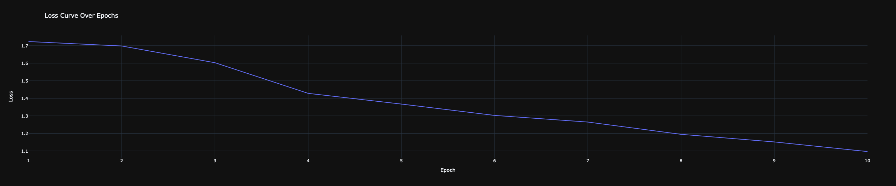

<h1 align="center">
    <a>
    
    </a>
</h1>

<h1 align="center"> RecycleVisionBot (Group 3) </h1>

<p align="center">
  <i align="center">A Recycle Robot that uses ML/AI to sort through recyclables ♻️ </i>
</p>

## Introduction
Given the current recycling rate of 32% in the United States (EPA, 2018), it is evident that refining our recyclable sorting methods is imperative to avoid misclassification at landfill disposal. This prompted the exploration of a robotic sorting system capable of accurately and efficiently sorting various recyclables on a conveyor belt. The objective is to overcome misclassification challenges, enhance overall recycling efficiency, and apply the knowledge acquired from the ECSE275 course to advance this project.

## Approach
### Building Blocks (Concepts):
#### Inverse Kinematics:
Inverse Kinematics (IK) is a way for robots to calculate how to move their joints to reach a particular position or angle. 

Utilizing the principles of Inverse Kinematic (IK), our approach allows the Franka Emika Panda 7 DOF robot to move its robotic arm joints with precision and efficiency by using the IK Solver Function, the system calculates the joint configurations necessary to achieve a desired end-effector position, ensuring optimal coordination and dexterity in sorting recyclables with utmost accuracy.

#### Robot Vision:
Robot Vision involves equipping robots with the ability to perceive and interpret visual information from their environment. It enables robots to "see" and make decisions based on the visual input they receive.

To enable the robot to precisely locate recyclables on the conveyor belt, we implement advanced robotic vision concepts. This involves tasks such as camera calibration, greyscaling the image, and coordinating transformations to accurately pinpoint the actual location of recyclables from the camera's perspective. By incorporating these vision techniques, we are able to allow the system to interpret visual data and make informed decisions in real-time, contributing to the efficiency and accuracy of the recycling process.

#### Neural Network for Object Detection:
Neural Network for Object Detection is a smart computer system that can spot and categorize things in pictures or videos. 

A Fully Connected Network (FCN) is a type of artificial neural network where each neuron in one layer is connected to every neuron in the subsequent layer. In an FCN, information flows bidirectionally, enabling complex relationships to be captured through learned weights and biases. 

Convolution Neural Network (CNN), a specific type of neural network, are great at understanding visual details, making them useful for tasks like recognizing objects. 

To ensure our system accurately classifies recyclables, we utilized CCHANGCS' [Garbage Classification Kaggle Dataset](https://www.kaggle.com/datasets/asdasdasasdas/garbage-classification). It includes 6 categories: cardboard, glass, metal, paper, plastic, and general trash. We use both FCN and CNN Model to train our datasets for our specific use case, and subsequently evaluating their performance against each other.

<h2> Fully Connected Network (FCN)
    <a></a>
    
    </a>
</h2>

<h2> Convoluted Neural Network (CNN)
    <a></a>
    
    </a>
</h2>

Dataset: https://www.kaggle.com/datasets/mostafaabla/garbage-classification/data


### Flow Chart:
<h2>
    <a>
    
    </a>
</h2>

```shell
Start
|
v
Proximity Sensor
|
v
Camera Image Capture
|
v
OpenCV Blob Detection
|
v
CNN Image Classification
|
v
Robotic Vision - Coordinates Extraction
|
v
Inverse Kinematics Calculation
|
v
Robotic Arm Movement
|
v
Recyclable Pickup
|
v
Bin Selection
|
v
Robotic Arm Placement
|
v
Recyclable Disposal
|
v
End

```


## Results
### Final Implementation (Side View)


### Final Implementation (Top View)


### FCN Model 
#### Demo


YouTube Link: https://youtu.be/isSXq3LtBTI
#### Results


### FCN 100 Model 
#### Demo


YouTube Link: https://drive.google.com/file/d/1XK-QQi5qijxYB7IB-gRo6g3SknBNv2Pu/view?usp=sharing
#### Results


### CNN Model 
#### Demo


YouTube Link: https://drive.google.com/file/d/1aNx444UxDq-3Dh4J92JkWOmINE44j2wp/view?usp=sharing
#### Results


### Summary


## Conclusion
In summary, the preliminary implementation of the RecycleVisionBot (ReViBot) showcases the practical application of concepts acquired in our coursework. By seamlessly integrating machine learning models and computer vision, the system  categorizes a diverse array of recyclables, directing the robotic arm to execute precise sorting into designated compartments. Looking forward, our future developments include the exploration of alternative models such as the YOLOv8 Architecture, and the incorporation of datasets from various sources to enhance the model's adaptability to a broader spectrum of recyclable items and environmental conditions.

While the initial results were higher than random selection, they illustrated a starting point for the refinement of the system. A few areas were identified for further investigation. 1) The Neural Networks were not validated outside of the simulation environment. This would be the first place to set a baseline to determine if the Neural Networks needed further refining or the test environment. 2) The simulation uses a 512px x 512px vision sensor to analyze the images. each cube is approximately 18px x 18px within the sensor, however, the training data uses images with a resolution of 512px x 384px. Thus, to perform analysis on the test cubes, the small cube image was rescaled from 18px x 18px to 512px x 384px. Increasing the resolution of the vision sensor would most likely lead to improved results. These opportunities for further development of the research show potential for the final application of RecycleVision Bot

## Contributors
`Jules Siegel (Leader)`: Spearheading the integration of the environment in CoppeliaSim by skillfully incorporating the Franka Emika Panda 7 DOF Robotic Arm and seamlessly integrating a conveyor belt system. Responsible for meticulously configuring the initial environment settings to ensure optimal functionality.

`Emily Hawkins (Test)`: Conducting rigorous Robot Performance Testing to assess the efficacy of various Machine Learning Models in efficiently sorting recyclables. Utilizing a comprehensive approach to evaluate and identify the best-performing models that meet the project's requirements.

`Jacob Boling (ML/AI)`: Taking charge of the training process for diverse Machine Learning Models, experimenting with different parameters to enhance their performance. Engaging in thorough exploration and optimization to achieve superior results in model training.

`Yap Jia Jun (Document)`: Playing a pivotal role in the project's documentation phase by capturing and articulating detailed findings and results. Creating comprehensive documentation that not only highlights key insights but also serves as a valuable resource for future reference.

`Juan Beaver (Integration)`: Orchestrating the seamless integration of trained Machine Learning Models into CoppeliaSim, ensuring a cohesive and efficient implementation. Focusing on the smooth transition from training to real-world application, Juan plays a crucial role in bridging the gap between theoretical models and practical simulation environments.

[//]: contributor-faces
<a href="https://github.com/JulesSiegel"></a>
<a href="https://github.com/emilyghawk"></a>
<a href="https://github.com/JacobBoling"></a>
<a href="https://github.com/yapjiajun"></a>
<a href="https://github.com/juanbeaver"></a>

## License
[MIT](https://choosealicense.com/licenses/mit/)


